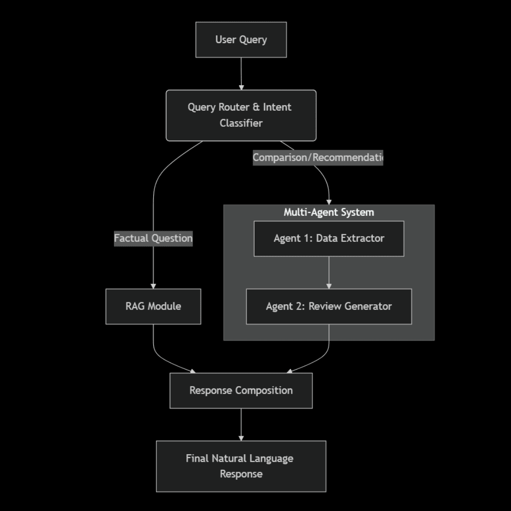

## Smart Assistant for Samsung Smartphone Buyers

**Samsung Phone Advisor** is an AI-powered assistant designed to help users make informed decisions when purchasing Samsung smartphones.  
The system combines **web scraping**, **PostgreSQL**, **FastAPI**, and **RAG[Retrieval-Augmented Generation]-based reasoning** to deliver detailed specifications and intelligent recommendations in natural language.

## Features

**Scrapes Real Data** — Automatically collects 20–30 Samsung smartphone specs (from startech).  
**Stores in PostgreSQL** — Saves structured data (model name, release date, display, battery, camera, RAM, storage, price).  
**RAG Module** — Retrieves exact phone specifications from the database.  
**Multi-Agent System** —  
- **Agent 1 (Data Extractor):** Fetches relevant phone data.  
- **Agent 2 (Review Generator):** Produces natural-language reviews or comparisons.  
**FastAPI Endpoint** — Users interact through `/` endpoint using natural-language queries.  

## FLow Charts / Project Thinking

## Project Structure

|── data/
│   └── data.csv        # Scraping dataset
├── agent_1.py          # Data extraction agent
├── agent_2.py          # Review generation agent
├── db_model.py         # Database models and engine
├── final_scrape.py     # Main scraping module
├── main.py             # FastAPI application entry point
├── rag.py              # RAG search functionality
└── scrapes.py          # Primary scraping      

## Installation

